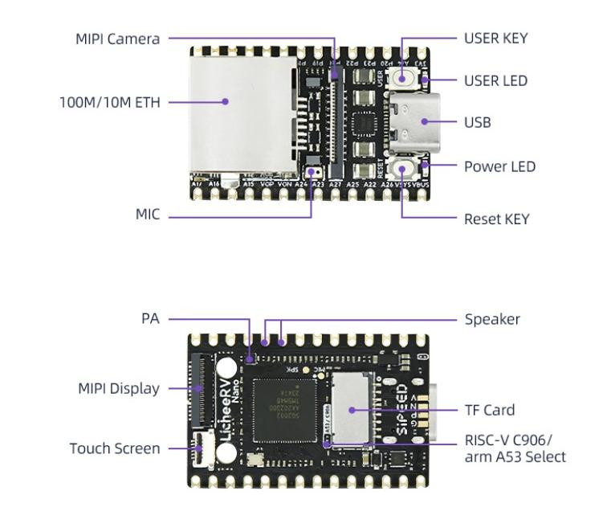
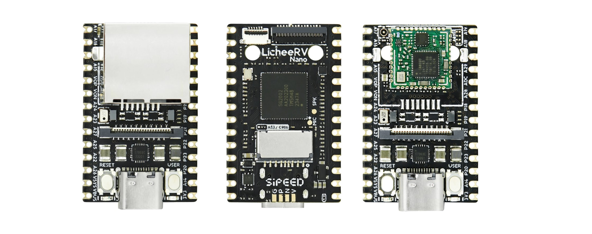

# Расположение компонентов на плате LicheeRV Nano

Обзор физического размещения компонентов платы (верх/низ) с размеченными
фото. Распиновка 2x14 header вынесена в `docs/sg2002_pin_map.md`
(+ `assets/RV_Nano_3.jpg`), здесь только сами компоненты и их привязка к
подсистемам bring-up.

Источник изображений это Sipeed wiki, intro-картинки LicheeRV Nano
(`wiki.sipeed.com/hardware/en/lichee/assets/RV_Nano/intro/`).

## Размеченная схема (top / bottom)

Верхняя сторона:
- MIPI Camera это разъём камеры (4-lane MIPI CSI), сверху
- 100M/10M ETH это Ethernet (внутренний PHY SG2002 + magnetics), только на вариантах E/WE, см. `docs/sipeed_resources.md`
- MIC это встроенный аналоговый MEMS-микрофон (LMA2718T421, левый вход ADC), см. `docs/audio_setup.md`
- USER KEY это пользовательская кнопка (gpio-keys, KEY_DISPLAYTOGGLE, porta 30)
- USER LED это синий пользовательский LED (GPIOA14, active-high), см. `docs/led_setup.md`
- USB это разъём Type-C (DWC2, dual-role), см. `docs/usb_setup.md`
- Power LED это красный индикатор питания 3.3V (LED2, к GPIO не подключён)
- Reset KEY это аппаратный сброс (SYS_RSTN, в Linux как клавиша не приходит)

Нижняя сторона:
- MIPI Display это разъём дисплея (MIPI DSI), FPC слева
- Touch Screen это разъём ёмкостного тача, рядом с дисплеем
- PA это аудио-усилитель AW8010A (включается по SPK_EN на время playback), см. `docs/audio_setup.md`
- Speaker это выход на динамик (header VOP/VON, внешний 8Ω)
- TF Card это слот microSD (SDIO0, загрузочный носитель)
- RISC-V C906 / arm A53 Select это площадки выбора загрузочного ядра (SG2002 двухъядерный, наш стек грузит C906 RISC-V)

## Фото платы (front / back / варианты)

Слева направо:
- фронт без Wi-Fi-модуля (варианты B/E): экран ETH, разъём MIPI-камеры, USB-C, кнопки RESET/USER
- оборот: SoC `SG2002` (маркировка `SG2002 AA202300`), слот TF, площадки `A53/C906` (выбор загрузочного ядра), silkscreen LicheeRV Nano / SiPEED, метки SPK/MIC/PI
- фронт с распаянным зелёным модулем Wi-Fi+BT (AIC8800D, варианты W/WE), см. `docs/wifi_setup.md`

Маппинг вариантов плат B/E/W/WE на PCB-ревизии Sipeed это `docs/sipeed_resources.md`.

## Связанные документы

- `docs/sg2002_pin_map.md` это распиновка 2x14 header (+ `assets/RV_Nano_3.jpg`)
- `docs/sipeed_resources.md` это варианты плат, Ethernet, ссылки на schematic/datasheet
- `docs/datasheets/` это SG2002 TRM и схемы LicheeRV Nano (70405/70415/70418) + манифест с SHA256
- per-peripheral `docs/*_setup.md` это bring-up каждой подсистемы (audio, gpio, led, usb, wifi, ...)
